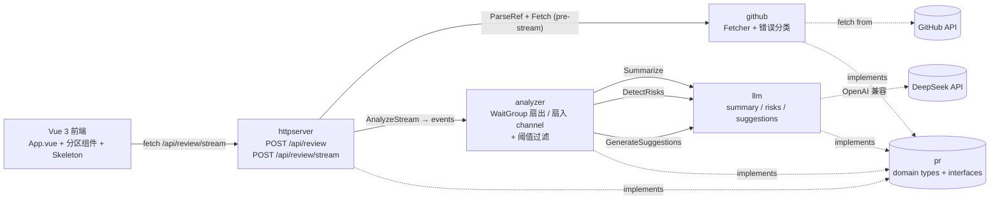
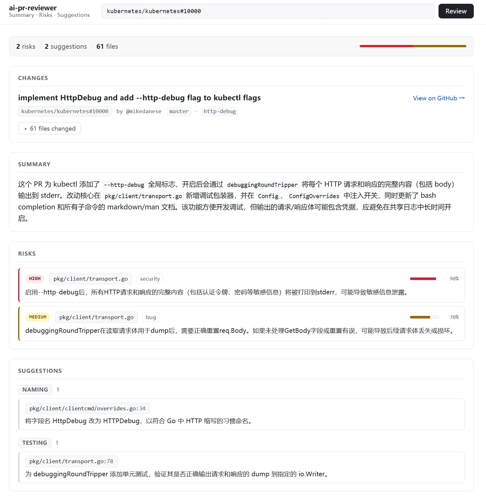

# ai-pr-reviewer

[](https://github.com/zhh2001/ai-pr-reviewer/actions/workflows/ci.yml)
[](LICENSE)
[](backend/go.mod)
[](https://vuejs.org)
[](https://vitejs.dev)

拉取指定 GitHub PR 的代码变更，调 DeepSeek 产出三类结果：总结、风险点、改进建议。
后端 Go + go-github + go-openai（DeepSeek 兼容 OpenAI 接口），前端 Vue 3 + Vite，
结果通过 NDJSON 流式分批返回，前端按事件渐进渲染。

设计取舍详见 [`docs/DESIGN.md`](docs/DESIGN.md)。

## 架构



接口都在 `pr` 包，实现散在外层。`*llm.Client` 一个对象实现三个接口
（Summarizer / RiskDetector / SuggestionGenerator），分别用不同模型；
handler 用三组 mock 注入即可全链路离线测试。两个对外端点共用 `analyzer`：
`/api/review` 走收集型 `Analyze`，`/api/review/stream` 走 `AnalyzeStream` 返回事件 channel。

## 目录结构

```text
.
├── backend/                     Go 后端
│   ├── cmd/server/              入口 main
│   └── internal/
│       ├── pr/                  domain：PRChanges / Risk / Suggestion + 4 个接口
│       ├── github/              go-github 封装 + 错误按状态码分类
│       ├── llm/                 DeepSeek 客户端 + 三套 prompt + JSON 解析（含 fence 兜底、逐条容错）
│       ├── analyzer/            三任务 WaitGroup 并发编排：收集型 + 流式 + 置信度过滤
│       ├── httpserver/          /healthz、POST /api/review、POST /api/review/stream
│       └── config/              env 变量装载
├── frontend/                    Vue 3 + Vite
│   └── src/
│       ├── App.vue              顶层：顶栏 / 输入 / 顶部错误 banner / 分区渐进渲染
│       ├── severity.js          severity 排序与样式（vitest）
│       ├── lib/                 markdown 消毒、NDJSON 切行、stream client、格式与 GitHub URL（全部 vitest）
│       └── components/          ChangesOverview / SummaryView / RisksSection / SuggestionsSection / ResultSummary / Skeleton
├── docs/
│   └── DESIGN.md                设计说明（架构 / 模型 / 上下文 / 误报 / 延迟 / 流式 / 健壮性）
├── .github/workflows/ci.yml     CI：后端 build/vet/test -race + 前端 npm ci/build/test
├── .env.example
└── README.md
```

## 环境变量

| 名 | 默认 | 说明 |
| --- | --- | --- |
| `GITHUB_TOKEN` | _(空，匿名)_ | 拉 PR 需要的 GitHub PAT，建议带 repo 读权限；匿名时撞 60 req/h 主限流。 |
| `DEEPSEEK_API_KEY` | _(空)_ | DeepSeek API key。空会让三个 LLM 通道都 401，但 fetch / handler 仍正常返回 `changes` 与三条 `*_error`。 |
| `ADDR` | `:8080` | 后端监听地址。 |
| `ANALYZE_TIMEOUT_SECONDS` | `180` | summary / risks / suggestions 并发跑共享的整体超时。非法 / 非正数回落默认。 |
| `RISK_CONFIDENCE_THRESHOLD` | `0.5` | risks 通道后置过滤阈值，`[0, 1]`。越界自动夹紧，非法回落默认。 |

复制 `.env.example` 为 `.env` 填写。密钥只走环境变量，别写进代码。

## 启动后端

Go 1.22+。

```bash
cd backend
export GITHUB_TOKEN=ghp_xxxxx
export DEEPSEEK_API_KEY=sk-xxxxx
go run ./cmd/server
# listening on :8080
```

健康检查：

```bash
curl -s http://localhost:8080/healthz
# {"status":"ok"}
```

## 启动前端

Node 18+。

```bash
cd frontend
npm install         # 或 npm ci，CI 用 ci
npm run dev
# Local: http://localhost:5173/
```

Vite dev server 已经把 `/api/*` 代理到 `http://localhost:8080`，**包括 NDJSON 流**——
实测 chunk 直通不缓冲，前端 `fetch().getReader()` 拿到的就是后端 `Flush()` 出来的字节。

生产构建：

```bash
npm run build       # dist/ 下静态资源
npm test            # vitest，46 个用例（severity / format / github URL / markdown / ndjson 切行）
```

## 端到端 curl 示例

### 流式（推荐，前端走的就是这条）

```bash
curl --no-buffer -N -s -X POST http://localhost:8080/api/review/stream \
  -H 'Content-Type: application/json' \
  -d '{"pr_url":"sashabaranov/go-openai#1000"}'
```

NDJSON 输出（每行一个事件，按通道完成时刻陆续到达）：

```text
{"type":"changes","changes":{...}}
{"type":"summary","summary":"..."}
{"type":"risks","risks":[...],"risks_filtered":0}
{"type":"suggestions","suggestions":[...]}
{"type":"done"}
```

任一通道失败用 `{"type":"<channel>","error":"..."}` 表达；fetch / parse 失败在写流之前
用 HTTP 状态码 + JSON 错误体返回，与下面的非流端点一致。

### 一次性 JSON（兼容老调用）

```bash
curl -s -X POST http://localhost:8080/api/review \
  -H 'Content-Type: application/json' \
  -d '{"pr_url":"google/go-github#3300"}' \
  | jq '{
      title: .changes.title,
      files_changed: (.changes.files | length),
      summary,
      risks_count: (.risks // [] | length),
      risks_filtered,
      suggestions_count: (.suggestions // [] | length),
      summary_error, risks_error, suggestions_error
    }'
```

返回信封示意（实际字段值由模型给出）：

```json
{
  "title": "...",
  "files_changed": 7,
  "summary": "5–10 句中文总结",
  "risks_count": 2,
  "risks_filtered": 1,
  "suggestions_count": 3,
  "summary_error": null,
  "risks_error": null,
  "suggestions_error": null
}
```

PR URL 两种格式都接：

- 完整链接 `https://github.com/{owner}/{repo}/pull/{number}`
- 简写 `{owner}/{repo}#{number}`

错误码（详见 `docs/DESIGN.md` 第 7 节）：

| 输入 | HTTP |
| --- | --- |
| 非法 PR URL | 400 |
| PR / 仓库不存在 | 404 |
| GitHub 限流 | 429 |
| 其它上游错误 | 502 |
| LLM 子任务失败 | 200，错误落到对应 `*_error` 字段（非流） / `{"type":"<channel>","error":"..."}` 事件（流） |

## 截图


